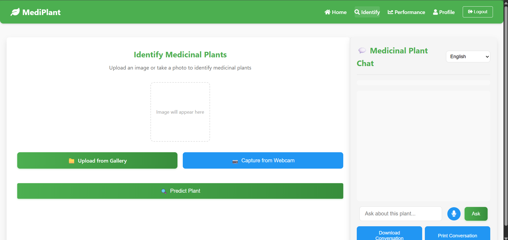

# Medicinal Plant Identification System

A sophisticated Flask web application that helps users identify medicinal plants using deep learning. The system provides detailed information about the identified plants along with audio feedback for enhanced user experience.

## Screenshots

### Home Page


### Plant Identification Page



## Features

- **User Authentication**: Secure login and signup system using Firebase
- **Plant Identification**: Advanced image processing using deep learning model
- **Audio Feedback**: Voice information about identified plants
- **User Profiles**: Personalized user experience
- **Performance Tracking**: Monitor identification history
- **Responsive Design**: Works on desktop and mobile devices

## Project Structure

```
├── app.py                 # Main Flask application
├── run.py                 # Application entry point
├── model/                 # Machine learning model files
├── static/
│   ├── audio/            # Generated audio files
│   ├── css/              # Stylesheets
│   ├── images/           # Static images
│   ├── js/               # JavaScript files
│   └── uploads/          # User uploaded images
└── templates/
    ├── home.html         # Home page template
    ├── index.html        # Main application template
    ├── login.html        # Login page
    ├── performance.html  # User performance tracking
    ├── profile.html      # User profile page
    └── signup.html       # Registration page
```

## Technologies Used

- **Backend**: Python, Flask
- **Machine Learning**: TensorFlow/Keras
- **Authentication**: Firebase
- **Frontend**: HTML5, CSS3, JavaScript
- **UI Framework**: Bootstrap
- **Database**: Firebase Realtime Database

## Setup and Installation

1. Clone the repository:

   ```bash
   git clone https://github.com/aajadhav2004/Medicinal-Plants-Identification-1.git
   ```

2. Install required packages:

   ```bash
   pip install -r requirements.txt
   ```

3. Configure Firebase:

   - Add your `firebase-credentials.json` file to the root directory
   - Update Firebase configuration in the application

4. Run the application:
   ```bash
   python run.py
   ```

## Usage Guide

1. **Registration/Login**

   - Create a new account or login with existing credentials
   - Complete your profile setup

2. **Plant Identification**

   - Navigate to the identification page
   - Upload a clear image of the medicinal plant
   - View the identification results
   - Listen to audio information about the plant

3. **Profile Management**
   - View identification history
   - Track performance
   - Update profile information

## Model Information

The system uses a deep learning model (`Medicinal_plant8_Not.h5`) trained on a diverse dataset of medicinal plants. The model employs transfer learning techniques for accurate plant identification.

## Important Note

This application is for educational and reference purposes only. The plant identification and information provided should not be considered as medical advice. Always consult qualified healthcare professionals before using any medicinal plants.

## Contributing

Contributions are welcome! For major changes:

1. Fork the repository
2. Create your feature branch
3. Commit your changes
4. Push to the branch
5. Open a pull request

## License

[MIT](https://choosealicense.com/licenses/mit/)
